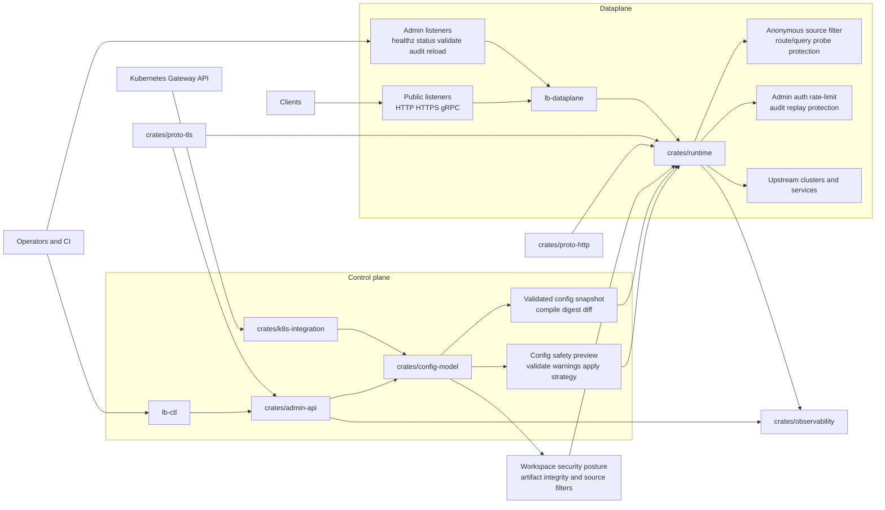

# way-balancer

Production-oriented Rust load-balance

## Current Scope

This repository now contains a substantial pre-GA product foundation:

- listener lifecycle and connection admission runtime
- TCP, HTTP/1.1, HTTP/2, and gRPC proxy foundations
- production-oriented HTTP response caching with purge, revalidation, bounded observability, and multi-node invalidation seams
- typed config model, validation, deterministic snapshot compilation, digesting, and diffing
- snapshot publication, rollout, rollback, authn/authz, abuse-control, and DR restore foundations
- Kubernetes Gateway API translation and reconciliation foundations
- secure-default posture, mTLS/certificate validation, and artifact integrity checks
- release compatibility, DR, and GA-readiness runbooks and evidence artifacts

The workspace is still pre-GA, but it already includes runnable dataplane/control-plane foundations and productization gates rather than only repo scaffolding.

## Implemented Subsystems

- `crates/runtime`: dataplane runtime, proxying, overload, probe, source guard, and snapshot-apply logic
- `crates/admin-api`: snapshot publication, rollout/rollback, admin auth, abuse control, mTLS, backup/restore hooks
- `crates/config-model`: typed config schema, validation, security posture, snapshot compiler, digest, and diff model
- `crates/k8s-integration`: Gateway API translation, reconciliation, and EndpointSlice foundations
- `crates/proto-http` and `crates/proto-tls`: protocol hardening and certificate-validation foundations
- `crates/observability`: metrics, tracing, diagnostics, support-bundle, and forensic export foundations
- `crates/test-support`: upgrade/rollback and restore smoke fixtures used by release gates

## Architecture Overview

The diagram below shows how the main control-plane and dataplane pieces fit together in a typical deployment.



## Workspace Layout

- `crates/`: shared libraries and architecture layers
- `binaries/`: deployable dataplane and control-plane entrypoints
- `examples/`: typed configuration examples for load balancer workspaces
- `tests/`: integration, property, and fuzz scaffolding
- `scripts/`: local developer and CI helper scripts
- `docs/`: contributor guides plus compatibility, DR, and release runbooks
- `artifacts/`: release-evidence inventory and SBOM/provenance artifact locations

## Build

Build the full workspace:

```sh
cargo build --workspace
```

Build the runnable entrypoints only:

```sh
cargo build -p lb-dataplane -p lb-ctl -p lb-k8s-controller
```

`lb-dataplane` also supports a local live mode with `serve --config <file>` for the checked-in example topologies.

Build OCI images from the checked-in `Dockerfile` by selecting the binary with `APP_BIN`:

```sh
docker build -t way-balancer-dataplane .
docker build --build-arg APP_BIN=lb-k8s-controller -t way-balancer-k8s-controller .
```

## Test

Run the full local verification flow:

```sh
./scripts/quality.sh
```

Common focused commands:

```sh
./scripts/check-coverage.sh
cargo test -p lb-test-support --test upgrade_rollback_smoke
cargo test -p lb-test-support --test snapshot_restore_smoke
cargo test -p lb-test-support --test example_configs
```

## Local Quality Commands

Run the primary verification entrypoint:

```sh
./scripts/quality.sh
```

This runs formatting, clippy, workspace tests, docs build, release-artifact consistency checks, secret-scanning hooks, and dependency audits when optional tools are installed.

Code coverage is enforced per Rust source file under `crates/*/src` and `binaries/*/src`: every file must stay at or above 80% line coverage. The coverage gate is backed by `cargo-llvm-cov` and can be run directly with:

```sh
./scripts/check-coverage.sh
```

Optional checks that rely on extra installed tools:

```sh
cargo deny check
cargo audit
./scripts/check-secret-scanning.sh
./scripts/generate-sbom.sh
./scripts/verify-provenance.sh
```

For the full local gate, install:

```sh
rustup component add llvm-tools-preview
cargo install cargo-llvm-cov cargo-deny cargo-audit cargo-nextest --locked
```

## Configure

The configuration model is a typed JSON document represented by `lb_config_model::WorkspaceConfig`. A workspace configuration typically includes:

- `api_version` and `name`
- `listeners` with bind address, protocol, class, and attached route names
- `routes` with a match rule and target upstream cluster
- `upstream_clusters` with endpoints and optional traffic policy
- optional `defaults`, `policies`, and `security`

Example configuration files live in `examples/load-balancer/`:

- `basic-http.json`: minimal HTTP edge listener with a conservative public-cache policy
- `http-cache-public.json`: public HTTP listener with a named shared-cache policy, safe defaults, and purge enabled
- `docker-compose-public-admin.json`: public plus admin HTTP listeners for the bundled Docker Compose demo, with bearer auth on the admin plane and a conservative public-cache policy on the public route
- `grpc-retries.json`: HTTP/2 or gRPC-style routing with retry-budget policy
- `https-termination.json`: HTTPS listener with file-backed TLS termination material and a conservative public-cache policy
- `public-admin.json`: public application traffic plus a separate localhost-only admin HTTP listener with explicit auth, rate limiting, audit retention, and a conservative public-cache policy on the public route
- `local-dev-insecure.json`: explicit development-only insecure override
- `sticky-sessions-cookie.json`: stateful app example that hashes a `session_id` cookie to a deterministic backend with explicit healthy fallback
- `virtual-hosts.json`: hostname-aware virtual-host routing example for separate web and API upstreams on one listener
- `example-com-api.json`: focused hostname-aware API routing example for `example.com/api?auth=user`

Validate those examples locally with:

```sh
cargo test -p lb-test-support --test example_configs
```

Validate the HTTPS listener surface and certificate loading path with:

```sh
cargo test -p lb-test-support --test https_listener_tls_smoke
```

Artifact attestation is enforced during snapshot publication and apply flows, not encoded inside the workspace JSON document. The `security` section controls local secure-default posture such as verification mode and any explicitly acknowledged dev-only override.

When `security.artifact_verification.mode` is `enforced`, the snapshot must be published and applied with an Ed25519 attestation whose `signer_identity` matches one of the configured `security.artifact_verification.trusted_signers` entries. Each trusted signer entry contains an `identity` plus a lowercase hex `public_key_ed25519` value.

The checked-in JSON examples intentionally leave `trusted_signers` empty. In a real deployment, the control-plane or operator must inject the trusted signer set that matches the private key used to attest published snapshots.

HTTPS listeners use `"protocol": "https"` plus a `tls_termination.certificate_source` block that points at PEM certificate and PEM private key files.

Admin listeners now use the typed `listeners[].admin` policy block. The default mode is bearer auth via `LB_CTL_ADMIN_SECRET`, but the config model also supports per-operator `signed_headers`, source allow-lists, bounded request rate limits, and in-memory audit retention for the `GET /audit` endpoint.

HTTP route rules can now include `match.hostnames` alongside `match.prefix`. Hostnames are normalized against the incoming `Host` or `:authority` value, reject ambiguous whitespace-separated forms, and query parameters continue to flow through automatically as part of the forwarded request target instead of being configured in the route match itself.

Upstream clusters may now opt into deterministic affinity with `upstream_clusters[].traffic_policy.affinity`. The current surface supports `header_hash` and `cookie_hash` sources. When the configured key is missing, the runtime keeps normal balancing behavior. When the preferred endpoint is unhealthy or ejected, `fallback: balance_healthy` explicitly re-enters healthy selection rather than pinning requests to a dead backend. This is intended for stateful workloads only and should be used sparingly because it can amplify hot spots.

When multiple routes match the same hostname, the matcher selects the most specific path prefix rather than the first declared catch-all route.

The current `lb-dataplane serve --config ...` demo wiring now preserves all endpoints declared in a matched route's referenced upstream cluster and dispatches traffic across that route-local upstream pool.

When route-aware serve mode is enabled, the dataplane also applies source-based progressive bans against application-mapping probes. Repeated host/path misses that produce local `403` responses and rapid churn of distinct query-parameter name sets on the same route are treated as enumeration signals and trigger temporary local `403` blocks with escalating durations. Query value churn by itself does not count as a new probe signature, so normal search, pagination, and filter usage is not penalized just for changing parameter values.

The shared `security.anonymous_source_filter` block is also optional. It supports direct IPv4/IPv6 source blocking via `deny_cidrs` plus category-specific CIDR lists for VPN, proxy, SOCKS, and Tor ranges. In `lb-dataplane serve --config ...`, any request whose source IP matches a configured IPv4 or IPv6 CIDR returns a local `403` before proxying.

The shared `security` block also supports an optional `anonymous_source_filter` posture for banning known VPN, proxy, SOCKS, and Tor source ranges. This is CIDR-driven rather than reputation-magic: you provide the IPv4/IPv6 CIDR lists for the categories you want to deny, and `lb-dataplane serve --config ...` returns local `403` responses when the client source IP falls inside an enabled category. The filter is disabled by default, and the checked-in `example-com-api.json` and `virtual-hosts.json` files show the configuration shape.

HTTP response caching is configured through `policies.http_caches` plus a `cache_policy` reference on a listener or route. Safe shared-cache defaults in this repository are:

- cache only `GET` and `HEAD`
- bypass requests carrying `Authorization` or `Cookie`
- keep `allow_set_cookie_storage` disabled
- use bounded in-memory storage with explicit `max_entries`, `max_bytes`, and `max_object_bytes`
- enable revalidation only when the origin emits stable validators such as `ETag` or `Last-Modified`

Operator-facing cache guidance lives in:

- `docs/runbooks/cache-operations.md`
- `docs/runbooks/cache-invalidation.md`
- `docs/runbooks/cache-performance.md`

Kubernetes controller packaging guidance lives in:

- `examples/kubernetes/lb-k8s-controller/README.md`
- `examples/kubernetes/lb-k8s-controller/deployment.yaml`
- `docs/runbooks/kubernetes-controller-operations.md`

The checked-in `serve --config` admin examples require an environment-provided bearer secret instead of embedded credentials:

```sh
export LB_CTL_ADMIN_SECRET=<admin-bearer-token>
```

Run the live demo stack with Docker Compose:

```sh
export LB_CTL_ADMIN_SECRET=<admin-bearer-token>
docker compose up --build
curl http://localhost:8080/
curl -H "Authorization: Bearer $LB_CTL_ADMIN_SECRET" http://localhost:9900/healthz
curl -H "Authorization: Bearer $LB_CTL_ADMIN_SECRET" http://localhost:9900/status
curl -H "Authorization: Bearer $LB_CTL_ADMIN_SECRET" http://localhost:9900/validate
curl -H "Authorization: Bearer $LB_CTL_ADMIN_SECRET" http://localhost:9900/audit
```

The compose file now builds a generic `lb-dataplane` image and injects only runtime environment needed by the checked-in workspace admin example. The admin listener remains bound to `0.0.0.0` inside the container so Docker can publish it, but Compose publishes `9900` only on `127.0.0.1`, and the listener itself requires bearer authorization. Use `GET /validate` before `POST /reload`, and inspect recent control-plane activity through `GET /audit`.

## Runbooks And Release Artifacts

- compatibility and upgrade policy: `docs/runbooks/compatibility-matrix.md`, `docs/runbooks/upgrade-rollback-policy.md`
- stability contract: `docs/runbooks/stability-contract.md`
- admin-plane security model: `docs/runbooks/admin-plane-hardening.md`
- dataplane performance envelope: `docs/runbooks/performance-envelope.md`
- cache configuration and operations: `docs/runbooks/cache-operations.md`, `docs/runbooks/cache-invalidation.md`, `docs/runbooks/cache-performance.md`
- Kubernetes controller packaging and operations: `docs/runbooks/kubernetes-controller-operations.md`
- disaster recovery: `docs/runbooks/disaster-recovery.md`
- release evidence and GA gate: `docs/runbooks/release-evidence-checklist.md`, `docs/runbooks/ga-readiness-review-template.md`
- evidence inventory: `artifacts/release-evidence-inventory.md`

