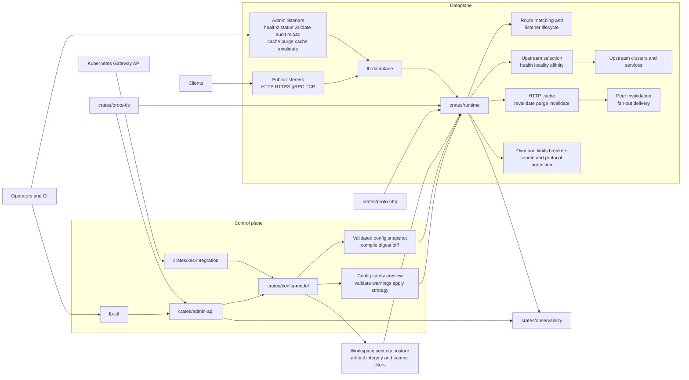

# Architecture

## System Overview

The repository is organized around a typed control-plane model and a runtime dataplane that consumes validated snapshots.

## Main Layers

### Control Plane

- `crates/config-model` defines the typed workspace schema and validation rules
- `crates/admin-api` provides snapshot publication, rollout, rollback, auth, audit, and cache-admin building blocks
- `crates/k8s-integration` translates Kubernetes Gateway API inputs into runtime config shapes

### Dataplane

- `binaries/lb-dataplane` provides the executable entrypoint
- `crates/runtime` owns listener lifecycle, routing, upstream health and affinity selection, cache handling, overload control, and config application
- `crates/proto-http` and `crates/proto-tls` harden protocol parsing and TLS material handling

### Supporting Systems

- `crates/observability` exposes metrics, tracing, diagnostics, and forensic export hooks
- `crates/test-support` carries smoke fixtures for upgrade, rollback, restore, and example validation

## Operational Boundaries

- public listeners handle application traffic across HTTP, HTTPS, gRPC, and TCP surfaces
- admin listeners expose privileged control endpoints such as `healthz`, `status`, `validate`, `audit`, `reload`, `cache/purge`, and `cache/invalidate`
- snapshots compile and validate before activation, allowing preview and rollback workflows
- cache invalidation and sticky-session affinity are runtime features, but both are driven by typed configuration and bounded operator controls
- security posture is explicit: artifact verification, source filtering, auth policy, and bounded runtime behavior are all modeled in configuration or runbooks

## Runtime Concerns

The runtime is not one feature. It combines several operational planes that now matter enough to document separately:

- routing and listener replacement state
- upstream health, locality, and affinity selection
- bounded HTTP cache with revalidation and invalidation
- overload management, breaker signals, and source or protocol protection

The dedicated [Admin API](admin-api.md), [HTTP Cache](cache.md), [Affinity](affinity.md), and [Troubleshooting](troubleshooting.md) pages cover those surfaces in more operational detail.

## Repository Layout

- `crates/` contains shared libraries and architecture layers
- `binaries/` contains the deployable executables
- `examples/` contains checked-in workspace config examples
- `docs/runbooks/` contains operator and release guidance

## Next Step

Open [Configuration](configuration.md) to see how listeners, routes, upstream clusters, cache policies, and affinity map onto this architecture, then continue into [Admin API](admin-api.md) for the operator-facing control surface.