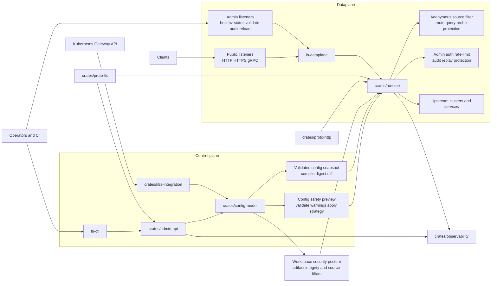

# Architecture

## System Overview

The repository is organized around a typed control-plane model and a runtime dataplane that consumes validated snapshots.

## Main Layers

## Control Plane

- `crates/config-model` defines the typed workspace schema and validation rules
- `crates/admin-api` handles snapshot publication, rollout, rollback, and admin controls
- `crates/k8s-integration` translates Kubernetes Gateway API inputs into runtime config shapes

## Dataplane

- `binaries/lb-dataplane` provides the executable entrypoint
- `crates/runtime` owns listener lifecycle, routing, upstream selection, overload handling, and config application
- `crates/proto-http` and `crates/proto-tls` harden protocol parsing and TLS material handling

## Supporting Systems

- `crates/observability` exposes metrics, tracing, diagnostics, and forensic export hooks
- `crates/test-support` carries smoke fixtures for upgrade, rollback, restore, and example validation

## Operational Boundaries

- public listeners handle application traffic
- admin listeners expose privileged control endpoints such as `healthz`, `status`, `validate`, `audit`, and `reload`
- snapshots compile and validate before activation, allowing preview and rollback workflows
- security posture is explicit: artifact verification, source filtering, auth policy, and bounded runtime behavior are all modeled in configuration or runbooks

## Repository Layout

- `crates/` contains shared libraries and architecture layers
- `binaries/` contains the deployable executables
- `examples/` contains checked-in workspace config examples
- `docs/runbooks/` contains operator and release guidance

## Next Step

Open [Configuration](configuration.md) to see how listeners, routes, upstream clusters, cache policies, and affinity map onto this architecture.