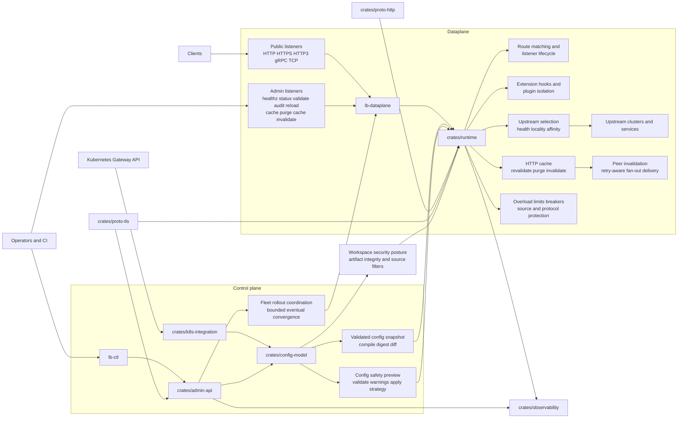

# Architecture

## System Overview

The repository is organized around a typed control-plane model and a runtime dataplane that consumes validated snapshots.

## Main Layers

### Control Plane

- `crates/config-model` defines the typed workspace schema and validation rules
- `crates/admin-api` provides snapshot publication, single-node and fleet rollout or rollback, auth, audit, cache-admin building blocks, and checksummed durable snapshot-registry export or restore primitives
- `crates/k8s-integration` translates Kubernetes Gateway API inputs into runtime config shapes

### Dataplane

- `binaries/lb-dataplane` provides the executable entrypoint
- `crates/runtime` owns listener lifecycle, routing, upstream health and affinity selection, cache handling, overload control, and config application
- `crates/proto-http` and `crates/proto-tls` harden protocol parsing and TLS material handling

### Supporting Systems

- `crates/observability` exposes metrics, tracing, diagnostics, and forensic export hooks
- `crates/test-support` carries smoke fixtures for upgrade, rollback, restore, and example validation

## Operational Boundaries

- public listeners handle application traffic across HTTP, HTTPS, HTTP/3 over QUIC, gRPC, and TCP surfaces
- admin listeners expose privileged control endpoints such as `healthz`, `status`, `validate`, `audit`, `reload`, `cache/purge`, and `cache/invalidate`
- snapshots compile and validate before activation, allowing preview and rollback workflows
- cache invalidation and sticky-session affinity are runtime features, but both are driven by typed configuration and bounded operator controls
- active-active fleets are supported through explicit bounded-eventual coordination and visibility rather than hidden distributed consensus inside the dataplane
- security posture is explicit: artifact verification, source filtering, auth policy, and bounded runtime behavior are all modeled in configuration or runbooks

## Runtime Concerns

The runtime is not one feature. It combines several operational planes that now matter enough to document separately:

- routing and listener replacement state
- upstream health, locality, and affinity selection
- bounded HTTP cache with revalidation and invalidation
- overload management, breaker signals, and source or protocol protection
- extension hook execution, policy plugin compatibility checks, and bounded isolation controls

Topology changes in upstream health are fail-closed by design. If cluster membership and tracked health records diverge during insertion, removal, or reload churn, the runtime now treats that as an explicit inconsistent state instead of silently dropping the affected endpoint from selection.

## Request Classification And Routing

Route selection is split across two layers on purpose:

- `crates/config-model` validates and compiles the typed route matcher surface
- `crates/proto-http` canonicalizes request attributes into a shared route-match input used by the runtime
- `crates/runtime` applies those compiled rules consistently for HTTP/1 and HTTP/2 before upstream selection, while the dataplane HTTP/3 listener reuses the same canonical route-match surface before bridging into the HTTP/1 upstream runtime

The current route matcher surface starts with path-prefix matching and can narrow further by:

- hostname
- HTTP method
- header matchers
- query-parameter matchers
- content-type media type
- source CIDR against the effective client IP

This split matters because HTTP/1 and HTTP/2 present request metadata differently. By normalizing method, authority, path, query pairs, header names, content type, and source address into one canonical shape inside `crates/proto-http`, the runtime avoids protocol-specific routing drift.

Once a route matches, upstream selection is now also split in two stages: the runtime first chooses a route destination such as stable, canary, blue, or green according to the route weights, and then balances inside that destination's endpoint pool using the cluster traffic policy. That keeps rollout intent at the route layer while preserving health, affinity, and locality behavior inside each upstream cluster.

HTTP/3 follows the same route-selection model. The downstream side terminates QUIC plus HTTP/3 on a public UDP listener, and runtime transport selection can dispatch to upstream clusters configured with `transport: http3` in addition to existing HTTP/1 and HTTP/2 paths. The remaining boundary is operational scope (for example admin-plane HTTP/3 listeners and QUIC passthrough), not route-selection semantics.

The runtime also exposes that route-destination decision in its connection reports. When route backend pools are active, `Http1ConnectionReport` and `Http2ConnectionReport` now carry `route_selection_metrics`, including weighted route selection counts, per-destination selection counts, and route-destination fallback counts. That makes local reproductions and integration harnesses show not only which upstream answered, but whether the request stayed on the primary destination or had to fall back.

Source-aware routing is evaluated after trusted client IP resolution. If a request arrives through a trusted proxy chain, the route `source_cidrs` filters use the effective client IP rather than the raw socket peer. If the peer is not trusted, the runtime keeps the direct peer address and ignores forwarded source hints.

When multiple routes match, the runtime resolves them by specificity rather than declaration order. Longest path prefix wins first, then more constrained matcher sets win over less constrained ones for equal prefixes. The operator-facing matcher syntax and examples live in [Configuration](configuration.md), while failure analysis and precedence debugging live in [Troubleshooting](troubleshooting.md).

The dedicated [Admin API](admin-api.md), [HTTP Cache](cache.md), [Affinity](affinity.md), and [Troubleshooting](troubleshooting.md) pages cover those surfaces in more operational detail.

## Repository Layout

- `crates/` contains shared libraries and architecture layers
- `binaries/` contains the deployable executables
- `examples/` contains checked-in workspace config examples
- `docs/runbooks/` contains operator and release guidance

## Next Step

Open [Configuration](configuration.md) to see how listeners, routes, upstream clusters, cache policies, and affinity map onto this architecture, then continue into [Admin API](admin-api.md) for the operator-facing control surface.