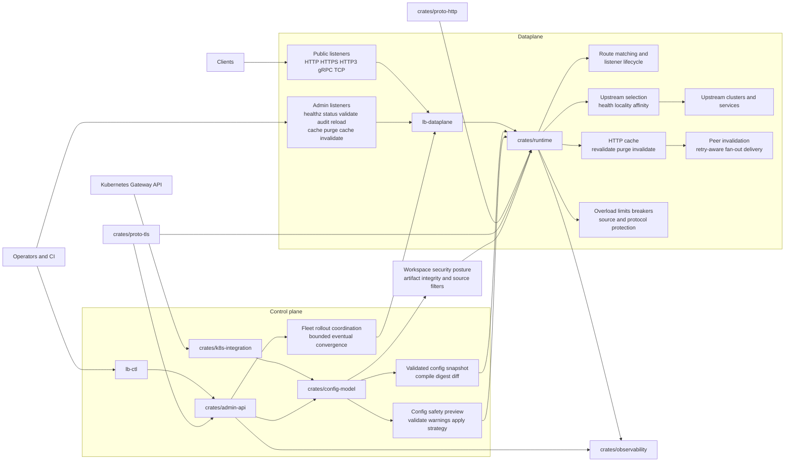

# way-balancer

way-balancer is a production-oriented Rust load balancer with explicit `0.1.x` release discipline: typed config validation, runtime reload mechanics, admin-plane controls, HTTP caching, Kubernetes translation, secure-default posture, and evidence-backed operator runbooks.

!!! info "GA release discipline"

  A candidate is considered release-ready only when the evidence set in the release checklist is complete, the support boundaries match the intended deployment, and the final GA review record is signed off.

## What This Site Covers

- how to build, verify, and run the project locally
- how the dataplane and control-plane pieces fit together
- how configuration, admin endpoints, cache policy, and affinity are modeled
- how to diagnose auth, reload, cache, affinity, and overload issues in production-like environments
- where to find runbooks for security, TLS, cache, DR, upgrade, and release evidence
- where to find the explicit support-boundary guidance for supported and unsupported deployment shapes

## System Overview

The diagram below is the canonical high-level scheme for the current control-plane and dataplane layout.

## Start Here

- `Getting Started`

  Build the workspace, run the local quality gates, start the demo stack, and exercise the public and admin endpoints.

- `Architecture`

  Understand the control plane, dataplane, runtime boundaries, and the role of each crate and binary.

- `Configuration`

  Learn the core `WorkspaceConfig` shape, example topologies, admin auth, caching, and sticky-session affinity.

- `Admin API`

  See the concrete admin endpoints, permissions, auth modes, request and response shapes, and operational sequencing.

- `HTTP Cache`

  Understand cache eligibility, revalidation, stale serving, purge, and distributed invalidation behavior.

- `Affinity`

  Learn when cookie or header hashing is appropriate, how fallback behaves, and how to avoid hot-spot mistakes.

- `Troubleshooting`

  Work through auth failures, reload problems, cache misses, affinity surprises, and overload symptoms.

- `Runbooks`

  Jump straight to hardening, cache operations, compatibility, support boundaries, DR, TLS, observability, and release guidance.

## Current Scope

The current repository includes:

- listener lifecycle and connection admission runtime
- TCP, HTTP/1.1, HTTP/2, and gRPC proxy foundations
- production-oriented shared HTTP caching with purge and revalidation hooks
- typed config compilation, digesting, validation, and diffing
- snapshot publication, rollout, rollback, authn/authz, and abuse-control foundations
- Kubernetes Gateway API translation and reconciliation foundations
- artifact integrity, TLS validation, and secure-default posture

## Fast Navigation

- For a local bring-up path, open [Getting Started](getting-started.md).
- For config structure and example files, open [Configuration](configuration.md).
- For live admin endpoints and operator workflows, open [Admin API](admin-api.md).
- For runtime behavior details, open [HTTP Cache](cache.md), [Affinity](affinity.md), and [Troubleshooting](troubleshooting.md).
- For operator workflows, open the `Runbooks` section in the left navigation.